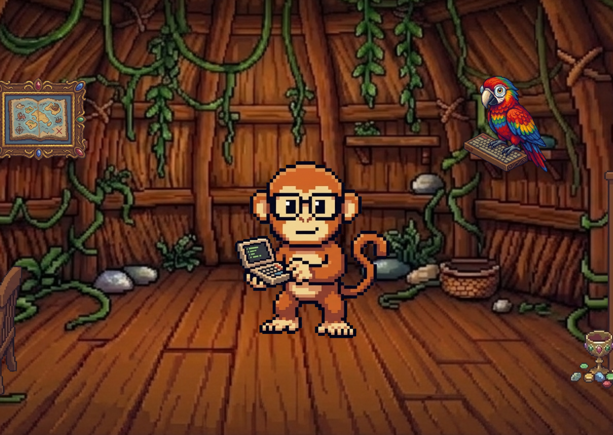
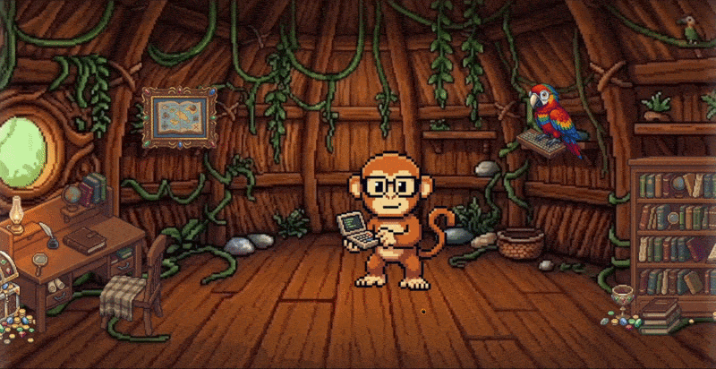

# 🚀 MirkoBechini-Portfolio

[](https://react.dev)
[](https://laravel.com)
[](https://vitejs.dev)
[](https://github.com/mirkobechini/mirko-bechini-portfolio/actions)

> Portfolio personale interattivo con stile retrò pixel-art, costruito con React, Laravel e NES.css.



---

## 📑 Indice

- [Demo](#-demo)
- [Caratteristiche principali](#-caratteristiche-principali)
- [Tech Stack](#️-tech-stack)
- [Quick Start](#-quick-start)
- [Script disponibili](#-script-disponibili)
- [Struttura del progetto](#-struttura-del-progetto)
- [GitHub Actions](#-github-actions)
- [Contatti](#-contatti)

---

## 🌍 Demo

- **Live:** [https://mirkobechini.com](https://mirkobechini.com)
  

---

## 🌟 Caratteristiche principali

- **Scena interattiva a scorrimento**: esplorazione orizzontale di un ambiente retrò popolato da sprite cliccabili.
- **Modali tematiche lazy-loaded**: About Me, Formazione & Competenze, Esperienze & Progetti, Certificazioni e Contatti — ogni modale è caricata dinamicamente con `React.lazy()` all'apertura.
- **Drag & touch navigation**: scrolling orizzontale fluido ottimizzato con `requestAnimationFrame` per mouse e dispositivi touch.
- **Navigazione da tastiera**: hook `useKeyboardNavigation` per spostarsi con le frecce all'interno delle modali (lineare o a griglia).
- **Stato globale con Context API**: apertura/chiusura modali e stato dell'app gestiti centralmente.
- **CSS modulare**: ogni componente ha il proprio foglio di stile incapsulato.
- **Backend Laravel 12**: rotta catch-al che服ve l'SPA React, pronto per future API.
- **Ottimizzazione asset**: preload di font e immagini critiche, PWA con service worker per caching intelligente.
- **CI/CD completo**: GitHub Actions con ESLint, build Vite, test PHP e audit Lighthouse.

---

## 🛠️ Tech Stack

| Settore              | Tecnologie                                                                                                                                                                                                                                                                                                                                                                                                                                                                                                                                  |
| :------------------- | :------------------------------------------------------------------------------------------------------------------------------------------------------------------------------------------------------------------------------------------------------------------------------------------------------------------------------------------------------------------------------------------------------------------------------------------------------------------------------------------------------------------------------------------ |
| **Frontend**         |                                                                                                       |
| **Backend**          |                                                                                                                                                                                                                                                                                                                                           |
| **Markup & Styling** |                                                                                                                                                                                                                                          |
| **Strumenti**        |      |

### Dipendenze principali

| Frontend                                                   | Backend                              |
| :--------------------------------------------------------- | :----------------------------------- |
| [React](https://react.dev) ^19.2.7                         | [Laravel](https://laravel.com) ^12.0 |
| [React Router](https://reactrouter.com) ^7.18              | [PHP](https://php.net) ^8.2          |
| [Vite](https://vitejs.dev) ^8.0                            |                                      |
| [NES.css](https://nostalgic-css.github.io/NES.css/) ^2.2.1 |                                      |
| [Axios](https://axios-http.com) ^1.7                       |                                      |

---

## 🚀 Quick Start

### Prerequisiti

- Node.js 24+
- PHP 8.2+
- Composer 2.x

### Installazione

```bash
# Clona la repository
git clone https://github.com/mirkobechini/mirko-bechini-portfolio.git
cd mirko-bechini-portfolio

# Installa dipendenze PHP (Laravel)
composer install

# Installa dipendenze JavaScript
npm install

# Prepara l'ambiente
cp .env.example .env
php artisan key:generate

# Avvia l'ambiente di sviluppo (unico comando)
npm run dev
```

Visita [http://localhost:8000](http://localhost:8000) nel browser.

### Build di produzione

```bash
npm run build
```

---

## 📜 Script disponibili

| Comando                           | Descrizione                                                                       |
| :-------------------------------- | :-------------------------------------------------------------------------------- |
| `npm run dev`                     | Avvia Vite (HMR) e Laravel (`php artisan serve`) in simultanea (via concurrently) |
| `npm run vite`                    | Solo dev server Vite                                                              |
| `npm run laravel`                 | Solo server Laravel                                                               |
| `npm run build`                   | Build di produzione Vite                                                          |
| `npm run lint`                    | Analisi statica del codice con ESLint                                             |
| `npm run preview`                 | Preview del build di produzione                                                   |
| `composer run pint`               | Formatta il codice PHP secondo lo stile Laravel                                   |
| `node scripts/resize-sprites.mjs` | Ridimensiona gli sprite nella dimensione desiderata                               |
| `php artisan serve`               | Avvia il server HTTP di Laravel                                                   |
| `php artisan key:generate`        | Genera la chiave dell'applicazione                                                |
| `php artisan test`                | Esegue i test PHPUnit                                                             |

---

## 📁 Struttura del progetto

```
mirko-bechini-portfolio/
├── app/                        # Logica backend Laravel
│   ├── Http/Controllers/       # Controller (vuoti, pronti per API future)
│   ├── Models/                 # Modelli Eloquent
│   └── Providers/              # Service provider
├── config/                     # Configurazioni Laravel
├── database/                   # Migrazioni, factories, seeders
├── public/
│   ├── assets/                 # Asset statici (backgrounds, modali, sprite)
│   ├── build/                  # Output build Vite (generato)
│   └── index.php               # Front controller Laravel
├── resources/
│   ├── js/
│   │   ├── app.js              # Entry point Vite (importa main.jsx)
│   │   ├── bootstrap.js        # Bootstrap JS (Axios)
│   │   └── src/                # ★ App React
│   │       ├── App.jsx         # Root component con Router e Context
│   │       ├── main.jsx        # Punto di ingresso React
│   │       ├── components/     # Componenti UI (layout, ScrollGuideIndicators)
│   │       │   ├── layout/     # DefaultLayout (Outlet router)
│   │       │   └── ui/         # Componenti UI puri riutilizzabili
│   │       ├── context/        # Stato globale con Context API
│   │       ├── data/           # Configurazioni e costanti (spriteConfig, uiConstants)
│   │       ├── features/       # Modali organizzati per sezione
│   │       │   └── modals/
│   │       │       ├── shared/         # BaseModal, ModalErrorBoundary, CSS condivisi
│   │       │       ├── about/         # AboutMeModal
│   │       │       ├── library/       # BookshelfModal, SkillsModal, FormationView
│   │       │       ├── projects/      # ProjectExperienceModal, ProjectsModal
│   │       │       ├── certifications/# CertificationsModal
│   │       │       └── contacts/      # ContactsModal
│   │       ├── hooks/          # Custom hooks (useDragScroll, useKeyboardNavigation)
│   │       ├── pages/          # Pagine (HomePage, 404)
│   │       ├── styles/         # CSS globali (global, home, responsive)
│   │       └── utils/          # Utility (asset paths, links, preloadImages)
│   └── views/
│       └── app.blade.php       # Template Blade SPA con preload di font e immagini
├── routes/
│   ├── web.php                 # Rotta catch-all per il frontend React
│   └── console.php             # Comandi Artisan (inspire)
├── scripts/
│   └── resize-sprites.mjs      # Utility per ridimensionamento sprite
├── tests/                      # Test PHPUnit
├── .github/workflows/
│   └── code-test.yml           # CI: ESLint → build → lychee → PHP test → Lighthouse
├── vite.config.js              # Configurazione Vite + React + Laravel + PurgeCSS
├── eslint.config.js            # Configurazione ESLint flat config
├── lighthouserc.json           # Soglie Lighthouse CI (SEO ≥ 0.95, Performance ≥ 0.7)
└── package.json                # Dipendenze e script Node
```

---

## 🤖 GitHub Actions

Il workflow **Verification Tests** (`code-test.yml`) si attiva su push e pull request verso `main` ed esegue in parallelo:

### `quality-checks`

1. ✅ **Setup Node.js** 24
2. ✅ **Cache** `node_modules`
3. ✅ **Install** `npm ci`
4. ✅ **ESLint** — analisi codice React
5. ✅ **Build Vite** — build di produzione
6. ✅ **lychee** — controllo link rotti nei template Blade

### `php-tests`

1. ✅ **Setup PHP** 8.2 + Composer
2. ✅ **Setup Node.js** 24
3. ✅ **Cache** vendor + node_modules
4. ✅ **Install** `composer install` + `npm ci`
5. ✅ **Build Vite** — asset di produzione
6. ✅ **Ambiente** `.env.ci` → `key:generate`
7. ✅ **Test** `php artisan test`

### `lighthouse`

- Eseguito solo su **push** a `main`, dopo il successo dei due job precedenti.
- Esegue audit con soglie: **SEO ≥ 0.95**, **Performance ≥ 0.7**

---

## 📞 Contatti

- **GitHub**: [@mirkobechini](https://github.com/mirkobechini)
- **LinkedIn**: [Mirko Bechini](https://www.linkedin.com/in/mirko-bechini-892202252/)
- **Sito**: In arrivo...
